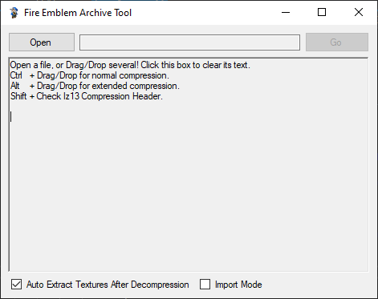

# FEAT

Fire Emblem Archive Tool (A tool to automatically extract data from 3DS Fire Emblem archives)

Credit to [ctpktool](https://github.com/polaris-/ctpktool), [DSDecmp](https://github.com/einstein95/dsdecmp), and [SPICA](https://github.com/gdkchan/SPICA) from which code is used for ctpk unpacking, LZ decompression, and bch parsing respectively. 

## Velouria Forked FEAT v1.9
- Added option to disable automatic texture extracting
- Added support for gfx texture contianers
- Added basic texture importing for bch
- Added ctpk rebuilding

## Velouria Forked FEAT v1.8
- Replaced FEAT's bch parseing with Spica's

## Velouria Forked FEAT v1.7
- Added lz13 Header check 
- Adjusted UI

## Velouria Forked FEAT v1.6
- Split old lz13 and  lz13 fix compression to Normal and Extended
- Changed Extended compression to Alt instead of Ctrl
- Added more info to starting message

## Velouria Forked FEAT v1.5
- Fixed lz13 Header size
- Removed confirm prompt when compressing files

