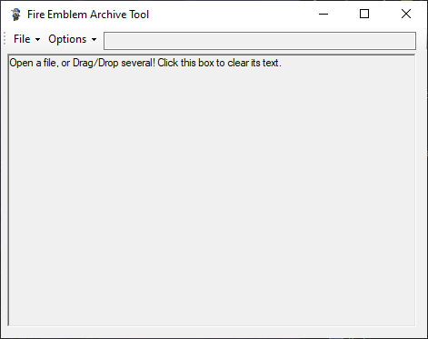

# FEAT

Fire Emblem Archive Tool (A tool to automatically extract data from 3DS Fire Emblem archives)

### Usage:
Drag and Drop files to decompress of extract them 
Drag and Drop a **file** while holding CTRL to compress it to lz13 
Drag and Drop a **folder** while holding CTRL to turn it into an ARC 
**Auto Extract** option will automatically extract files, when possible, after decompression. 
**Build Textures** enables BCH texture importing and CTPK rebuilding. 
Drag and Drop and folder with a bch in the same directory to import replace the files in the bch with the matching ones in the folder. 
Drag and Drop an Extract CTPK folder to rebuild the CTPK. 
**Arc Padding** adds the padding for arc files used by Fates. 
**Arc File Alignment** adjust the byte alignment for files inside the arc. Fates uses 128 while Awakening usually uses 0 

### Credit to:  
[ctpktool](https://github.com/polaris-/ctpktool) for ctpk packing and unpacking, 
[DSDecmp](https://github.com/einstein95/dsdecmp) for LZ decompression, 
[SPICA](https://github.com/gdkchan/SPICA) for bch/gfx Parsing, 
[FEIF_Arc](https://github.com/GovanifY/FEIF_ARC) for Arc packing and unpacking 
[SciresM](https://github.com/SciresM) for the original FEAT code

## Velouria Forked FEAT v2.2
- UI Overhual
- Improved Arc building code
- Fixed ctpk building bug
- Fixed .bcmdl files not extracting

## Veloruia Forked FEAT v2.1
- Fixed Arc rebuilding code

## Velouria Forked FEAT v2.0
- Added Arc rebuilding
- Expanded list of options
- Packed .dll into exe

## Velouria Forked FEAT v1.9
- Added option to disable automatic texture extracting
- Added support for gfx texture containers
- Added basic texture importing for bch
- Added ctpk rebuilding

## Velouria Forked FEAT v1.8
- Replaced FEAT's bch parsing with Spica's

## Velouria Forked FEAT v1.7
- Added lz13 Header check 
- Adjusted UI

## Velouria Forked FEAT v1.6
- Split old lz13 and  lz13 fix compression to Normal and Extended
- Changed Extended compression to Alt instead of Ctrl
- Added more info to starting message

## Velouria Forked FEAT v1.5
- Fixed lz13 Header size
- Removed confirm prompt when compressing files

